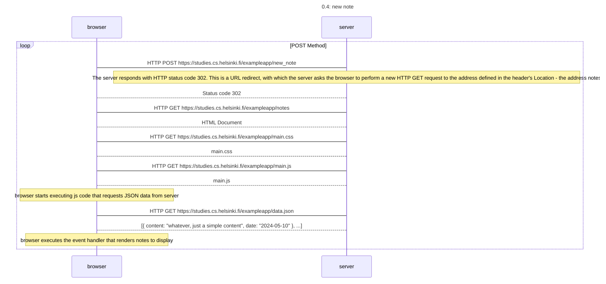

# 0.4: new note

```mermaid
sequenceDiagram
    Title: 0.4: new note

    loop POST Method
        browser->server: HTTP POST https://studies.cs.helsinki.fi/exampleapp/new_note
        note over server: The server responds with HTTP status code 302. This is a URL redirect, with which the server asks the browser to perform a new HTTP GET request to the address defined in the header's Location - the address notes
        server-->browser: Status code 302
        browser->server: HTTP GET https://studies.cs.helsinki.fi/exampleapp/notes
        server-->browser: HTML Document
        browser->server: HTTP GET https://studies.cs.helsinki.fi/exampleapp/main.css
        server-->browser: main.css
        browser->server: HTTP GET https://studies.cs.helsinki.fi/exampleapp/main.js
        server-->browser: main.js

        note over browser: browser starts executing js code that requests JSON data from server

        browser->server: HTTP GET https://studies.cs.helsinki.fi/exampleapp/data.json
        server-->browser: [{ content: "whatever, just a simple content", date: "2024-05-10" }, ...]

        note over browser: browser executes the event handler that renders notes to display
    end
```